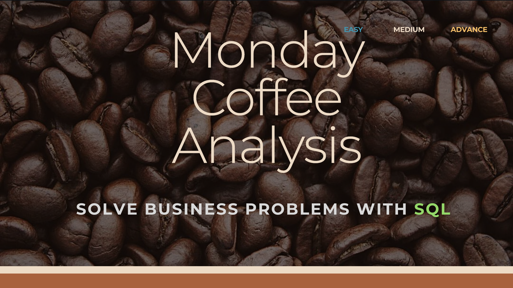
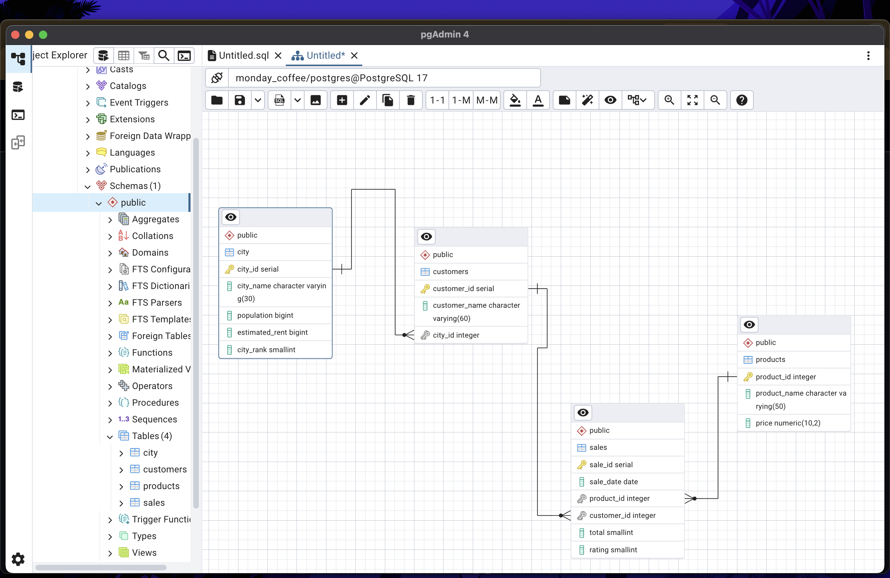

# monday-coffee-analysis


```markdown
# Monday Coffee Database Project

## Database and Tables Creation

-- first we create a database name monday_coffee

-- then we we create some table 

```sql
CREATE TABLE city (
    city_id SERIAL PRIMARY KEY,
    city_name VARCHAR(30) NOT NULL,
    population BIGINT,
    estimated_rent BIGINT,
    city_rank SMALLINT
);

CREATE TABLE product (
    product_id SERIAL PRIMARY KEY,
    product_name VARCHAR(50) NOT NULL,
    price NUMERIC(10,2)
);

ALTER TABLE product RENAME TO products;

CREATE TABLE customers (
    customer_id SERIAL PRIMARY KEY,
    customer_name VARCHAR(60),
    city_id INT,
    CONSTRAINT fk_city FOREIGN KEY (city_id) REFERENCES city(city_id)
);

DROP TABLE IF EXISTS sales;

CREATE TABLE sales (
    sale_id SERIAL PRIMARY KEY,
    sale_date DATE,
    product_id INTEGER,
    customer_id INTEGER NOT NULL, 
    total smallint,
    rating SMALLINT,
    CONSTRAINT fk_products FOREIGN KEY (product_id) REFERENCES products(product_id),
    CONSTRAINT fk_customers FOREIGN KEY (customer_id) REFERENCES customers(customer_id)
);
```

## Sample Select Queries

```sql
select * from sales
select * from public.city
select * from public.customers
select * from public.products
```

## Business Problems and Queries

### 1) Coffee Consumers Count  
How many people in each city are estimated to consume coffee, given that 25% of the population does?

```sql
select * from public.city

select 
      city_name,
      (population * 0.25) / 1000000  coffee_consumers_in_millions
from public.city
order by 2 desc
```

### 2) Total Revenue from Coffee Sales  
What is the total revenue generated from coffee sales across all cities in the last quarter of 2023?

```sql
select * from sales
select * from public.city

select 
      ci.city_name,
      sum(s.total) as total_revenue
from sales as s
join customers as c
on
  s.customer_id = c.customer_id
join
city as ci
on 
ci.city_id = c.city_id
where
     extract(year from s.sale_date) = 2023
     and
     extract(quarter from s.sale_date) = 4
group by 1 
```

### 3) Sales Count for Each Product  
How many units of each coffee product have been sold?

```sql
select * from public.products
select * from sales

select 
p.product_name,
count(s.sale_id) as sold_unit
from products as p
left join
sales as s
on
s.product_id = p.product_id
group by 1
```

### 4) Average Sales Amount per City  
What is the average sales amount per customer in each city?

```sql
select * from sales
select * from city 
select * from customers

select
      sum(s.total) as total_revenue,
      count(distinct s.customer_id) as total_customer,
    ci.city_name as city,
    sum(s.total)/ count(distinct s.customer_id) as avg_sales_amt_cx
from customers as c
join 
city as ci
on 
ci.city_id = c.city_id
join
sales as s
on
s.customer_id = c.customer_id
group by 3
order by 2 desc
```

### 5) City Population and Coffee Consumers (25%)  
Provide a list of cities along with their populations and estimated coffee consumers.

```sql
WITH city_table AS 
(
    SELECT 
        city_name, 
        ROUND((population * 0.25) / 1000000, 2) AS coffee_consumer 
    FROM city
),
customer_table AS
(
    SELECT 
        ci.city_name,
        COUNT(DISTINCT c.customer_id) AS unique_customer
    FROM sales AS s
    JOIN customers AS c
        ON c.customer_id = s.customer_id
    JOIN city AS ci
        ON ci.city_id = c.city_id
    GROUP BY 1
)

SELECT
    customer_table.city_name,
    city_table.coffee_consumer AS coffee_consumers_in_millions,
    customer_table.unique_customer
FROM city_table
JOIN customer_table
    ON city_table.city_name = customer_table.city_name;
```

### 6) Top Selling Products by City  
What are the top 3 selling products in each city based on sales volume?

```sql
select * from sales
select * from city
select * from products

-- city → customers → sales → products , join aise lagaye

WITH city_product_sales AS (
    SELECT 
        ci.city_name,
        p.product_name,
        COUNT(s.sale_id) AS total_sales
    FROM sales s
    JOIN customers c ON s.customer_id = c.customer_id
    JOIN city ci ON c.city_id = ci.city_id
    JOIN products p ON s.product_id = p.product_id
    GROUP BY 1, 2
),
ranked_sales AS (
    SELECT 
        city_name,
        product_name,
        total_sales,
        ROW_NUMBER() OVER (PARTITION BY city_name ORDER BY total_sales DESC) AS rank_in_city
    FROM city_product_sales
)
SELECT 
    city_name,
    product_name,
    total_sales
FROM ranked_sales
WHERE rank_in_city <= 3
ORDER BY city_name, total_sales DESC;
```

### 7) Customer Segmentation by City  
How many unique customers are there in each city who have purchased coffee products?

```sql
select * from city
select * from products
select * from customers

-- city → customers → sales

     ci.city_name,
     count(distinct c.customer_id) as unique_customer
     from city as ci
left join
customers as c 
on c.city_id = ci.city_id
join
sales as s
on
s.customer_id = c.customer_id 
where s.product_id in (1,2,3,4,5,6,7,8,9,10,11,12,13,14)       
group by 1
```

### 8) Average Sale vs Rent  
Find each city and their average sale per customer and avg rent per customer

```sql
select * from customers
select * from city
select * from public.sales

WITH city_table AS (
    SELECT 
        ci.city_name,
        SUM(s.total) AS total_revenue,
        COUNT(DISTINCT s.customer_id) AS total_cx,
        ROUND(
            SUM(s.total)::numeric / COUNT(DISTINCT s.customer_id)::numeric
        ,2) AS avg_sale_pr_cx
    FROM sales s
    JOIN customers c ON s.customer_id = c.customer_id
    JOIN city ci ON ci.city_id = c.city_id
    GROUP BY ci.city_name
),
city_rent AS (
    SELECT 
        city_name,
        estimated_rent
    FROM city
)
SELECT 
    ct.city_name,
    ct.total_cx,
    ct.avg_sale_pr_cx,
    cr.estimated_rent,
    ROUND(cr.estimated_rent::numeric / ct.total_cx::numeric, 2) AS avg_rent_pr_cx
FROM city_table ct
JOIN city_rent cr 
ON ct.city_name = cr.city_name
ORDER BY ct.city_name;
```

### 9) Monthly Sales Growth  
Sales growth rate: Calculate the percentage growth (or decline) in sales over different time periods (monthly).

```sql
WITH monthly_sales AS (
    SELECT 
        ci.city_name,
        EXTRACT(YEAR FROM s.sale_date) AS year,
        EXTRACT(MONTH FROM s.sale_date) AS month,
        SUM(s.total) AS total_sale
    FROM sales AS s
    JOIN customers AS c
        ON s.customer_id = c.customer_id
    JOIN city AS ci
        ON ci.city_id = c.city_id
    GROUP BY ci.city_name, year, month
    ORDER BY ci.city_name, year, month
),
growth_calc AS (
    SELECT 
        city_name,
        year,
        month,
        total_sale,
        LAG(total_sale) OVER (PARTITION BY city_name, year ORDER BY month) AS prev_month_sale,
        ROUND(
            ((total_sale - LAG(total_sale) OVER (PARTITION BY city_name, year ORDER BY month)) 
            / NULLIF(LAG(total_sale) OVER (PARTITION BY city_name, year ORDER BY month), 0)) * 100, 
            2
        ) AS sales_growth_percent
    FROM monthly_sales
)
SELECT *
FROM growth_calc
WHERE sales_growth_percent IS NOT NULL
  AND sales_growth_percent <> 0;
```

### 10) Market Potential Analysis  
Identify top 3 city based on highest sales, return city name, total sale, total rent, total customers, estimated coffee consumer

```sql
WITH city_stats AS (
    SELECT 
        ci.city_name,
        SUM(s.total) AS total_sale,
        SUM(ci.estimated_rent) AS total_rent,
        COUNT(DISTINCT c.customer_id) AS total_customers,
        ROUND((ci.population * 0.25)::numeric / 1000000, 2) AS estimated_coffee_consumer
    FROM sales AS s
    JOIN customers AS c
        ON s.customer_id = c.customer_id
    JOIN city AS ci
        ON ci.city_id = c.city_id
    GROUP BY ci.city_name, ci.population
)
SELECT 
    city_name,
    total_sale,
    total_rent,
    total_customers,
    estimated_coffee_consumer
FROM city_stats
ORDER BY total_sale DESC
LIMIT 3;
```
